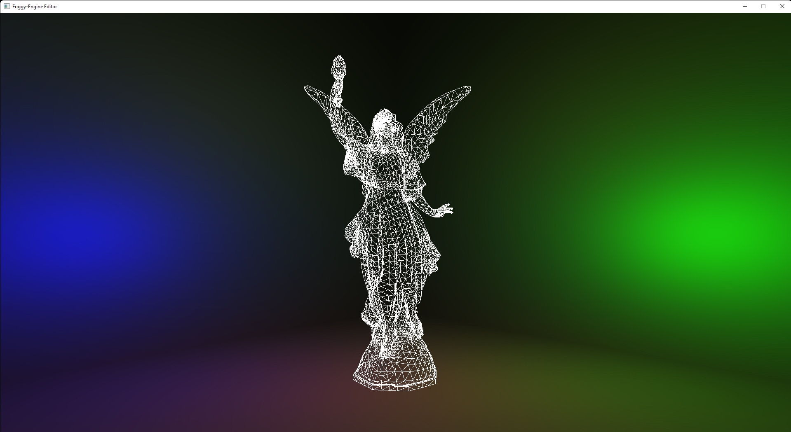
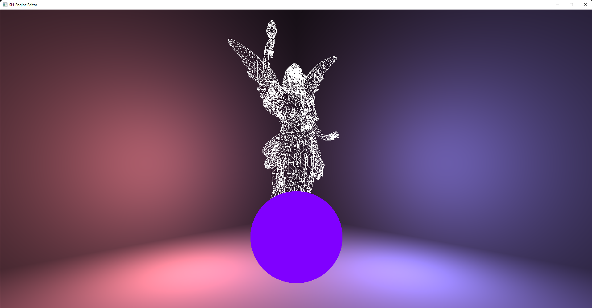

# SH-Engine

[Build status](#build-status)

[Current features](#current-features)
* [To do](#to-do)

[Build from source](#build-from-source)
* [Engine targets only](#engine-targets-only)
* [simulation-sample](#simulation-sample)
* [flappy-circle](#flappy-circle)

---

# [Build status](https://github.com/MrSinho/Foggy-Engine/tree/main/.ShCI)

[](https://github.com/MrSinho/Sh-Engine/tree/main/.ShCI/linux-log.md)
[](https://github.com/MrSinho/Sh-Engine/tree/main/.ShCI/windows-log.md)

The engine has been tested on Windows 10, Linux Mint (virtual machine) and Ubuntu with different compilers (`MSVC`, `gcc`), and hardware configurations (`RX580 4GB GDDR5`, `Radeon V Carrizo 500MB`).



# Current features:
 - Entity Component System using [ShECS](https://github.com/MrSinho/ShECS) by MrSinho
 - Full glsl shader customization
 - Ply mesh loader using [PlyImporter](https://github.com/MrSinho/PlyImporter) by MrSinho
 - Depth buffer support
 - Scene creation and customization by setting up a scene.json file
 - Custom shader handling (more about that in the Coulomb shader and example)
    * define shader general properties in materials.json
    * set up shader input parameters for each entity (if required) in scene.json
    * material extension structures support
 - Native scripting in C:
    * simulation.json sets up some properties for a shared library, which functions are called in runtime
    * to generate the cmake target given the external application name, run export-simulation.py

## To do:
 * Compute Shaders
 * Double/triple buffering
 * Textures
 * Audio

---

# Build from source

```bash
git clone --recursive https://github.com/MrSinho/SH-Engine
cd SH-Engine
``` 

## Engine targets only

```bash
mkdir build
cd build 
cmake ..
cmake --build .
```

---

## simulation-sample



```batch
python export-simulation.py "simulation-sample" SHARED
cd build 
cmake --build .
```

---

## flappy-circle


```batch
python export-simulation.py "flappy-circle" SHARED
cd build 
cmake --build .
```

---

# Binaries and output

The built targets are in the `bin` directory.
