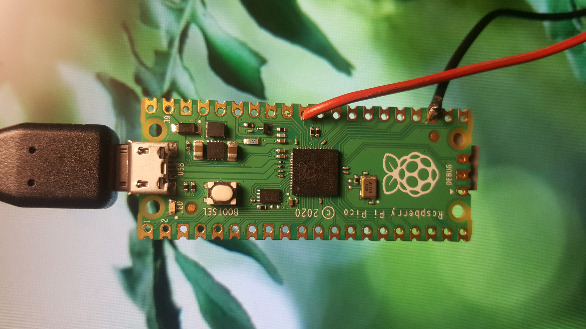

# SH-Engine

[Build status](#build-status)

[](https://github.com/MrSinho/shengime/tree/main/.shci/linux-log.md)
[](https://github.com/MrSinho/shengine/tree/main/.shci/windows-log.md)


[Current features](#current-features)
* [To do](#to-do)

[Build from source](#build-from-source)
* [Engine targets only](#engine-targets-only)
* [simulation-sample](#simulation-sample)
* [flappy-circle](#flappy-circle)
* [serial-demo](#serial-demo)
   * [Pinout for the Raspberry Pi pico and UF2 binary](#pinout-for-the-raspberry-pi-pico-and-uf2-binary)

---

# [Build status](https://github.com/MrSinho/Foggy-Engine/tree/main/.ShCI)

[](https://github.com/MrSinho/shengime/tree/main/.shci/linux-log.md)
[](https://github.com/MrSinho/shengine/tree/main/.shci/windows-log.md)

The engine has been tested on Windows 10, Linux Mint (virtual machine) and Ubuntu with different compilers (`MSVC`, `gcc`), and hardware configurations (`RX580 4GB GDDR5`, `Radeon V Carrizo 500MB`).


# Current features:
 - Multithreading using [shthreads](https://github.com/mrsinho/shthreads)
    * Main engine thread
    * the "`load`" can safely read and write memory at `void* ShEngine::p_engine_extension` without the need of synchronization objects: the memory pointed is reserved for the simulation modules. However, using the extension memory (also) inside the default functions ("`[...]_start`", "`[...]_update`" "`[...]_close`" etc.) won't be thread safe without synchronization objects. You can easily work with those using the library named above. The engine will still have to wait the end of the thread to complete the "release operations" 
 - Entity Component System using [shecs](https://github.com/MrSinho/shecs)
 - Full glsl shader customization
 - Ply mesh loader using [plyimporter](https://github.com/MrSinho/plyimporter)
 - Depth buffer support
 - Serial communication using [shserial](https://github.com/MrSinho/shserial)
 - Scene creation and customization by setting up a scene.json file
 - Custom shader handling (more about that in the Coulomb shader and example)
    * define shader general properties in materials.json
    * set up shader input parameters for each entity (if required) in scene.json
    * material extension structures support
 - Native scripting in C:
    * simulation.json sets up some properties for a shared library, which functions are called in runtime
    * to generate the cmake target given the external application name, run export-simulation.py

## To do:
 * Diagram build tools (2D and 3D)
 * External customizable launcher
 * External gui running in parallel with editor (or maybe improve shgui?)
 * Currently only single thread application
 * Manage Compute Shaders using descriptors
 * Textures
 * Audio 

---


# Build from source

```bash
git clone --recursive https://github.com/MrSinho/SH-Engine
cd SH-Engine
``` 

## Engine targets only

```bash
mkdir build
cd build 
cmake ..
cmake --build .
```

---

## simulation-sample

Just a random scene.


```batch
python export-simulation.py "simulation-sample" SHARED
cd build 
cmake --build .
```

---

## flappy-circle

A Flappy Bird clone in a circular map. Press `SPACE` to let it survive.


```batch
python export-simulation.py "flappy-circle" SHARED
cd build 
cmake --build .
```

---

## serial-demo

Any variation of analog input for the Raspberry Pi Pico affects the lighting in the scene.


```batch
python export-simulation.py "serial-demo" SHARED
cd build 
cmake --build .
```
Note: because the simulation does not include multithreading, reading serial data blocks all gpu calls.

## Pinout for the Raspberry Pi Pico and UF2 binary
It's connected to a `1.5V` solar panel (it could be a potentiometer or any analogic sensor). The negative charged cable (in red) is connected to `ADC input 0`, `GPIO 26`. The program to run on the Raspberry Pi Pico is located at [simulations/serial-demo/pico-bin/shengine_sample_raw.uf2](simulations/serial-demo/pico-bin/shengine_sample_raw.uf2).

You should correct the serial port name in case the one at [simulations/serial-demo/src/serial-demo.c](simulations/serial-demo/src/serial-demo.c) doesn't match.



---

# Binaries and output

The built targets are in the `bin` directory.
