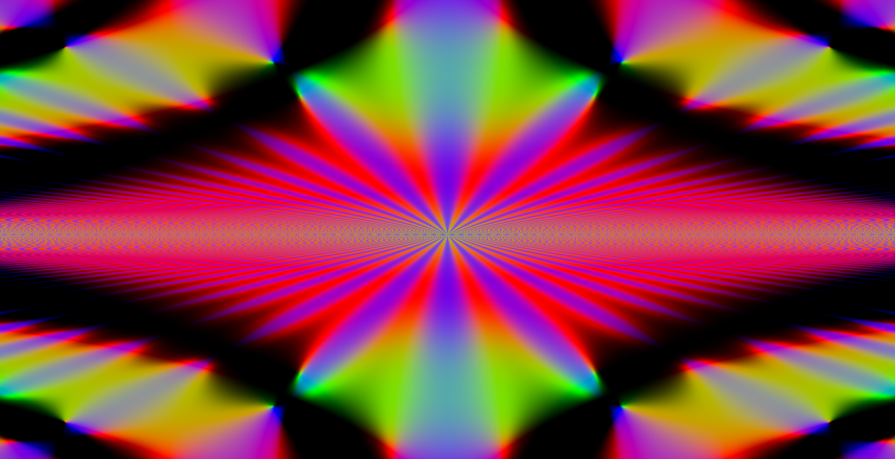

# Noise application example

[TOC]



Using Windows (run as admin):
```bash
python export-application.py name=noise target=EXECUTABLE path=applications/noise
cd applications/noise/windows/build
cmake --build .
cp ../../ini.smd ../bin/ini.smd
```

Using Linux:
```bash
sudo python3.9 export-application.py name=noise target=EXECUTABLE path=applications/noise
cd applications/noise/linux/build
sudo cmake --build .
sudo cp ../../ini.smd ../bin/ini.smd
```

## Application tour

To change the values of the parameters `S` `A` and `B`:

|Parameter    |Increase key    |Decrease key    |
|-------------|----------------|----------------|
| `S`         |       _W_      |       _Q_      |
| `A`         |       _S_      |       _A_      |
| `B`         |       _X_      |       _Z_      |

Fragment shader algorithm:

\f$  c = \cos(\pi x y s)\f$  


\f$
RGB_{raw} = \begin{bmatrix}
\sin(\pi |x| {s \over a}) + c\\
\sin(\pi |y| {s \over b}) + c\\
\cos(\pi  s  {x \over y}) + c\\
\end{bmatrix}
\f$

Every 2 seconds the parameters values get saved at `applications/noise/smd/noise-interface.smd`, which is a text-based interface written in an [`smd`](https://github.com/mrsinho/smd) format, from which you can read the parameters values in runtime. You can export these values to `applications/noise/smd/noise-saved.smd` by pressing `LEFT_CTRL` + `E`. When the application is reloaded (`LEFT_CTRL` + `R`) the default parameters written at `applications/noise/smd/noise-recovery.smd` will be read. You can load the exported values by pressing `LEFT_CTRL` + `L`.

---

\f$  s = {1 \over 2} \f$  

\f$  a = 1\f$  

\f$  b = -2,5\f$  


---

\f$  s = {1 \over 2} \f$  

\f$  a = 1\f$  

\f$  b = -2,5\f$  


---

\f$  s = 4\f$  

\f$  a = 4,5\f$  

\f$  b = -1,8\f$  


---

\f$  s = 4\f$  

\f$  a = 5\f$  

\f$  b = 7\f$  


---

